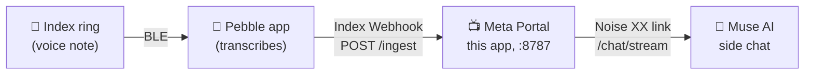

# Portal Pebble Muse Bridge

Turn a **Meta Portal** (1st gen, Android 9) into a **Muse gadget**, so voice notes from a **Pebble Index 01 ring** land in a **Muse AI** chat.



The Portal pairs with the Muse app over Bluetooth exactly like an official community gadget, then keeps an encrypted link to your Muse cloud VM. The Pebble app's built-in **Index Webhook** posts each transcription to the Portal, which forwards it to Muse.

> **Unofficial hobby project.** Not affiliated with Meta or Core Devices. The Portal reports no Bluetooth LE support, so this app reaches the system GATT service directly. It may break after a Portal update. Proceed at your own risk.

## What you need

- A Meta Portal with **ADB enabled**, on your home Wi-Fi
- JDK 17 and the Android SDK to build
- An **SDK token** (`mgst_…`) from [gadgets.muse.ai](https://gadgets.muse.ai/settings/sdk-tokens)
- The **Muse app** (iOS or Android) with **Settings → Devices → Developer mode** on
- A **Pebble Index 01** ring and the Pebble app

## 1. Build and install

```bash
cp .env.example .env        # put your mgst_ token in MUSE_SDK_TOKEN
./gradlew assembleDebug
adb install -r app/build/outputs/apk/debug/app-debug.apk
adb shell am start -n com.portal.pebblebridge/.ui.MainActivity
```

`.env` values are only defaults for a fresh install. After the first launch, change them in the app's **⚙ Settings**.

## 2. Pair with Muse

1. On the Portal, open the app. It advertises as `MuseGadgetXXXXXX`.
2. In the Muse app: **Settings → Devices → Add Device (+)**, pick `MuseGadgetXXXXXX`, and continue past the community-device warning.
3. When asked for Wi-Fi, pick the network shown (the Portal is already online).

After pairing, the Portal opens its cloud link. **Expect 403 errors in the log for a few minutes after pairing or any app restart.** The edge accepts the link after roughly 2–7 minutes. If it never does, create a **new SDK token** and pair again.

Optional: set a **side chat ID** (any new UUID) in ⚙ Settings so ring notes go to their own Muse chat instead of the main one.

## 3. Connect the Pebble ring (Index Webhook)

In the Pebble app: **Index 01 Settings → Webhook**, pick a gesture (e.g. *Hold & talk*), then:

| Field | Value |
|---|---|
| URL | `http://<portal-ip>:8787/ingest` (the Portal's Wi-Fi IP is shown on its screen) |
| What to send | **Transcription only** (audio isn't needed and may exceed the 1 MB limit) |

Tap **Send test event**, then **Save**. Speak into the ring and the note shows up in Muse.

## 4. Use it away from home (Tailscale)

The webhook URL above only works when your phone is on the same Wi-Fi as the Portal. [Tailscale](https://tailscale.com) gives the Portal a private address your phone can reach from anywhere (office, mobile data), without opening your router to the internet.

1. **Install Tailscale on the Portal.** It has no Play Store, so sideload the official APK:
   ```bash
   curl -LO https://pkgs.tailscale.com/stable/tailscale-android-universal-latest.apk
   adb install tailscale-android-universal-latest.apk
   ```
   Open Tailscale on the Portal, tap **Log in**, sign in, and accept the VPN request.
2. **Install Tailscale on your phone** and sign in with the **same account**. Make sure it's switched on. Phones run one VPN at a time, so turn off any other VPN.
3. **Find the Portal's Tailscale address** (`100.x.y.z`) in the Tailscale app or at [login.tailscale.com/admin/machines](https://login.tailscale.com/admin/machines).
4. **Check it from the phone:** open `http://100.x.y.z:8787/health` in the browser. You should see `{"ok":true,…}`.
5. **Point the webhook at it:** change the Pebble webhook URL to `http://100.x.y.z:8787/ingest`. This works at home too.
6. **Keep it logged in:** in the Tailscale admin console, open the Portal's **⋯** menu and choose **Disable key expiry**.

Test by turning Wi-Fi off on your phone and recording a note over mobile data.

**Troubleshooting**
- *Webhook test fails:* is Tailscale on and connected on the phone, and does the device list show the Portal?
- *Testing from a laptop fails but the phone works:* other VPN apps on the laptop (Mullvad, Cloudflare WARP, …) often block Tailscale traffic. Test from the phone.
- *After a power cut:* check that Tailscale on the Portal reconnected, then give Muse a few minutes to accept the Portal again.

## Endpoints

| Path | Use |
|---|---|
| `POST /ingest` | Pebble Index Webhook (multipart form, `transcription` field), JSON `{"text": …}`, or plain text |
| `POST /api/mcp` | MCP (Streamable HTTP) with a `send_muse_note` tool, for agents |
| `GET /health` | Status check |

Set an **MCP token** in ⚙ Settings to require `Authorization: Bearer <token>` (or `X-Pebble-Token`) on `/ingest` and `/api/mcp`. In the Pebble webhook, add it as a header. Without a token, anyone who can reach the Portal can post notes.

## How it works

- `ble/`: GATT server and community pairing v5 (ECDH, encrypted envelopes, `provision_v2`), mirroring the Linux SDK.
- `muse/`: `fetch_vms`, token refresh, and the Noise XX WebSocket link to `wss://<noise_host>/v1/noise` (default `hatch.metaaivm.com`), `link.register`, and `/chat/stream`.
- `server/`: a small HTTP server for `/ingest`, MCP and `/health`.

The protocol follows Meta's [muse-gadget-sdk](https://github.com/facebookincubator/muse-gadget-sdk) (Apache-2.0). If you have a Raspberry Pi, that SDK's `linux/examples/pebble_ring_bridge.py` is the officially supported way to do the same thing.

## License

MIT, see [LICENSE](LICENSE).
