# Portal Pebble Muse Bridge

Turn a **Meta Portal** (1st gen, Android 9) into a **Muse gadget**, so voice notes from a **Pebble Index 01 ring** land in a **Muse AI** chat. The Portal also gets a Game Boy–style home screen and screensaver, where an 8-bit robot shows each note as it arrives.


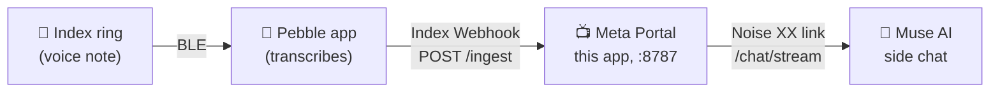

The Portal pairs with the Muse app over Bluetooth exactly like an official community gadget, then keeps an encrypted link to your Muse cloud VM. The Pebble app's built-in **Index Webhook** posts each transcription to the Portal, which forwards it to Muse.

> **Unofficial hobby project.** Not affiliated with Meta or Core Devices. The Portal reports no Bluetooth LE support, so this app reaches the system GATT service directly. It may break after a Portal update. Proceed at your own risk.

## What you need

- A Meta Portal with **ADB enabled**, on your home Wi-Fi
- JDK 17 and the Android SDK to build
- An **SDK token** (`mgst_…`) from [gadgets.muse.ai](https://gadgets.muse.ai/settings/sdk-tokens)
- The **Muse app** (iOS or Android) with **Settings → Devices → Developer mode** on
- A **Pebble Index 01** ring and the Pebble app

## 1. Build and install

```bash
cp .env.example .env        # put your mgst_ token in MUSE_SDK_TOKEN
./gradlew assembleDebug
adb install -r app/build/outputs/apk/debug/app-debug.apk
adb shell am start -n com.portal.pebblebridge/.ui.MainActivity
```

`.env` values are only defaults for a fresh install. After the first launch, change them in the app: long-press the home screen to open **Settings**, then tap **⚙ Connection**.

## 2. Pair with Muse

1. On the Portal, open the app. It advertises as `MuseGadgetXXXXXX`.
2. In the Muse app: **Settings → Devices → Add Device (+)**, pick `MuseGadgetXXXXXX`, and continue past the community-device warning.
3. When asked for Wi-Fi, pick the network shown (the Portal is already online).

After pairing, the Portal opens its cloud link. **Expect 403 errors in the log for a few minutes after pairing or any app restart.** The edge accepts the link after roughly 2–7 minutes. If it never does, create a **new SDK token** and pair again.

Optional: set a **side chat ID** (any new UUID) in **Settings → ⚙ Connection** so ring notes go to their own Muse chat instead of the main one.

## 3. Connect the Pebble ring (Index Webhook)

In the Pebble app: **Index 01 Settings → Webhook**, pick a gesture (e.g. *Hold & talk*), then:

| Field | Value |
|---|---|
| URL | `http://<portal-ip>:8787/ingest` (shown in **Settings → Status**) |
| What to send | **Transcription only** (audio isn't needed and may exceed the 1 MB limit) |

Tap **Send test event**, then **Save**. Speak into the ring and the note shows up in Muse.

Each note reaches Muse with a short line added at the end: *(Transcribed from speech, so some words may be misheard. Please go by what I most likely meant.)* That way Muse reads past transcription mistakes. The Portal shows only your words.

## 4. Use it away from home (Tailscale)

The webhook URL above only works when your phone is on the same Wi-Fi as the Portal. [Tailscale](https://tailscale.com) gives the Portal a private address your phone can reach from anywhere (office, mobile data), without opening your router to the internet.

1. **Install Tailscale on the Portal.** It has no Play Store, so sideload the official APK:
   ```bash
   curl -LO https://pkgs.tailscale.com/stable/tailscale-android-universal-latest.apk
   adb install tailscale-android-universal-latest.apk
   ```
   Open Tailscale on the Portal, tap **Log in**, sign in, and accept the VPN request.
2. **Install Tailscale on your phone** and sign in with the **same account**. Make sure it's switched on. Phones run one VPN at a time, so turn off any other VPN.
3. **Find the Portal's Tailscale address** (`100.x.y.z`) in the Tailscale app or at [login.tailscale.com/admin/machines](https://login.tailscale.com/admin/machines).
4. **Check it from the phone:** open `http://100.x.y.z:8787/health` in the browser. You should see `{"ok":true,…}`.
5. **Point the webhook at it:** change the Pebble webhook URL to `http://100.x.y.z:8787/ingest`. This works at home too.
6. **Keep it logged in:** in the Tailscale admin console, open the Portal's **⋯** menu and choose **Disable key expiry**.

Test by turning Wi-Fi off on your phone and recording a note over mobile data.

**Troubleshooting**
- *Webhook test fails:* is Tailscale on and connected on the phone, and does the device list show the Portal?
- *Testing from a laptop fails but the phone works:* other VPN apps on the laptop (Mullvad, Cloudflare WARP, …) often block Tailscale traffic. Test from the phone.
- *After a power cut:* check that Tailscale on the Portal reconnected, then give Muse a few minutes to accept the Portal again.

## Pixel home screen

The app opens on a Game Boy–style home screen. It uses one four-shade palette at a time and groups related things together (Gestalt): the robot with its speech bubble on the left, the time, date and weather together on the right, then the month below.

- **Left:** an 8-bit robot on a lit LCD "stage". It dances, blinks and smiles. Tap it to make it jump, throw hearts and switch dance moves.
- **Right:** a big pixel clock, the date and the current weather together, then this month's calendar with today highlighted.
- **Ring notes** pop up as a Game Boy dialog box above the robot, typed out letter by letter. The robot waves and "talks" while it types, and the box shows whether the note reached Muse. Tap the box to close it.
- **Tap any empty spot** to cycle color themes: Classic, Pocket, Ice, Sunset, Sakura, Virtual Boy and Matcha. **Long-press** anywhere to open Settings.

| A ring note arrives | Tap the robot |
|---|---|
| 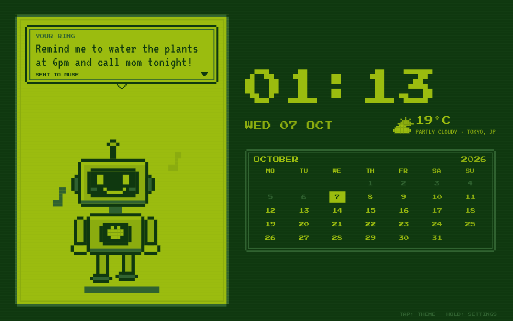 | 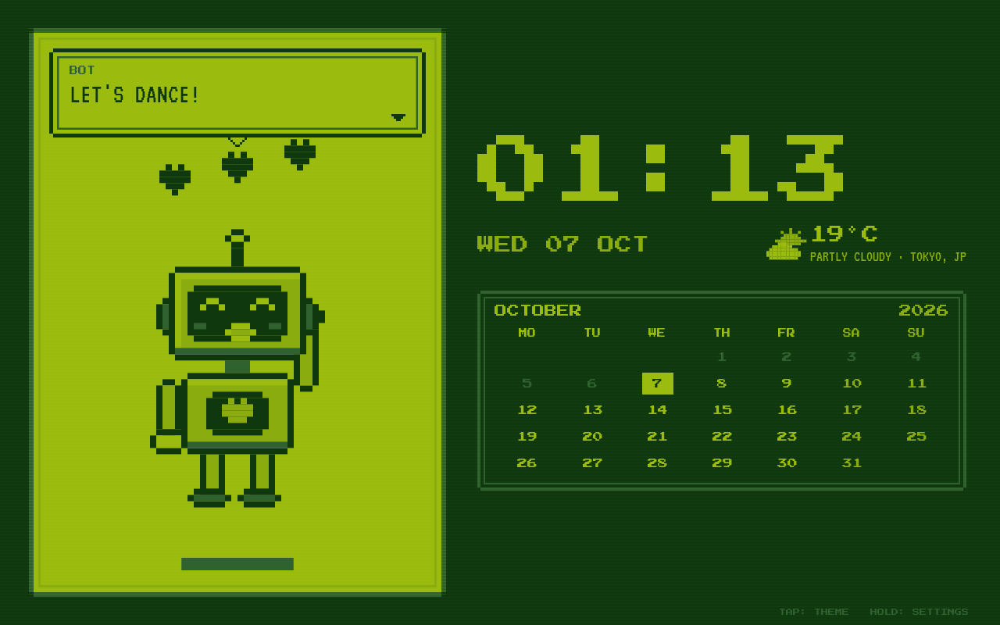 |

**Color themes** (tap any empty spot to switch):

| Classic | Pocket | Ice | Sunset |
|---|---|---|---|
| 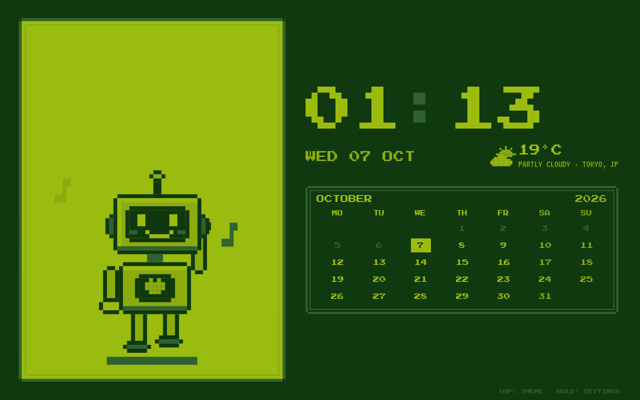 | 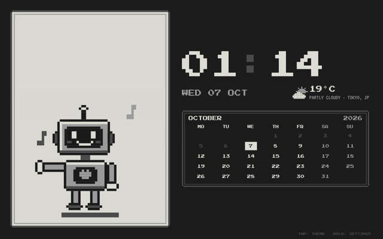 | 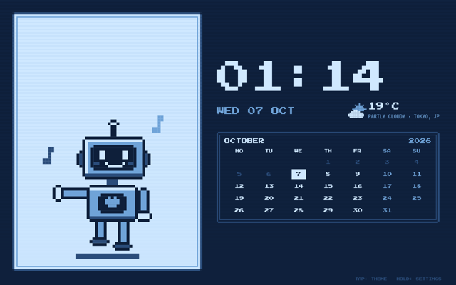 | 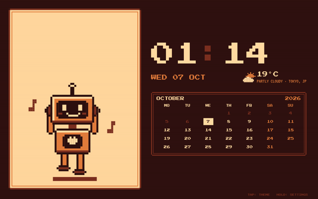 |
| **Sakura** | **Virtual Boy** | **Matcha** | |
| 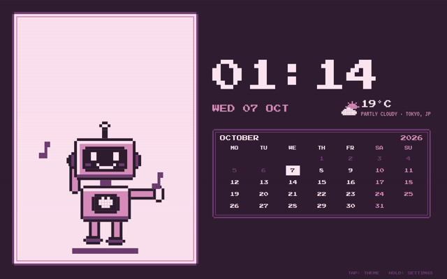 | 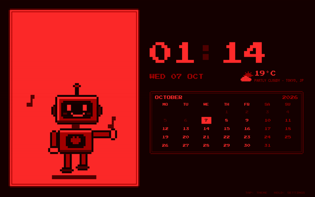 | 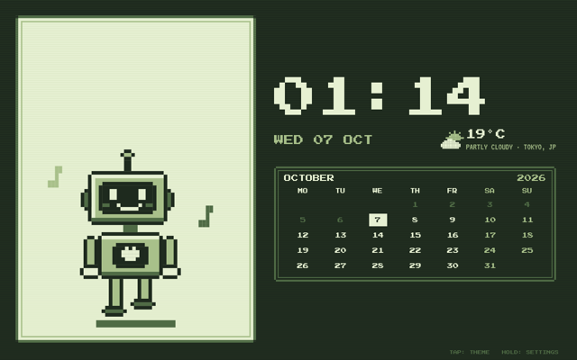 | |

Weather comes from [Open-Meteo](https://open-meteo.com/) (free, no key). By default the city is detected from your IP via geojs.io. You can set a city in Settings.

### Settings

Long-press the home screen to open them:

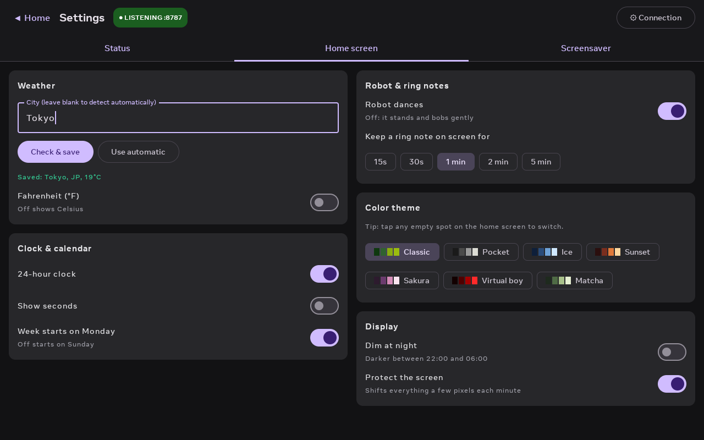

| Tab | What's there |
|---|---|
| **Status** | Webhook URLs (home and Tailscale), send a test note, pairing and cloud-link status, live note feed. **⚙ Connection** holds the tokens and side-chat ID. |
| **Home screen** | Weather city, °C/°F, 24-hour clock, seconds, week start, robot dancing, how long note bubbles stay, color theme, night dimming, burn-in protection |
| **Screensaver** | Use as the Portal screensaver, keep the screen on, permission status |

### Use it as the Portal screensaver

Grant the permission once, then turn on **Settings → Screensaver → Use as Portal screensaver**:

```bash
adb shell pm grant com.portal.pebblebridge android.permission.WRITE_SECURE_SETTINGS
```

The app remembers your previous screensaver and restores it if you turn this off. The Portal's launcher resets the screensaver on boot, so the app re-applies it every few minutes, and at once whenever another app changes it.

To try it without waiting for the Portal to go idle:

```bash
adb shell am start -n com.android.systemui/.Somnambulator
```

**Third-party launchers.** Some launchers fight over the screensaver. Immortal launcher, for example, sets its own photo frame back, switches screensavers off when its photo frame is off, and wakes the Portal right after any screensaver starts. The app copes with all three: it re-applies its screensaver at once, and it opens the home screen the instant the screensaver is created. If the launcher's photo frame still covers the robot, turn the photo frame off in the launcher's settings.

## Muse on the Portal

Ideas and protocol details here come from [hey-muse](https://github.com/wobsoriano/hey-muse), which turns an Echo Show into a Muse voice gadget.

- **Answers on screen.** After a ring note, the robot's bubble shows what Muse replied ("MUSE: …"). The app reads answers from Muse's `/chat/subscribe` stream; `/chat/stream` only acknowledges a message.
- **Talk to Muse.** Hold the robot, speak, and let go. The Portal records 16 kHz WAV and sends it to Muse as a voice note, which Muse transcribes. The robot shows what Muse heard, then the answer. Grant the microphone once: `adb shell pm grant com.portal.pebblebridge android.permission.RECORD_AUDIO`.
- **Spoken answers.** Answers and messages are read aloud with Android text-to-speech, using the Portal's built-in voice (English, French, German, Italian, Spanish). It has no Vietnamese voice, so Vietnamese answers are shown on screen but not read aloud. **Settings → Muse** shows the voice engine's status.
- **Auto play and History.** Finished answers, Muse's messages and timers play one after another (shown and spoken), so a new one never cuts off the last. Long answers flip through pages. Tap the bubble to skip. Everything is kept in **HISTORY** (bottom-right of the home screen, last 200, saved across restarts); tap an entry to play it again. Turn auto play off in **Settings → Muse** and answers wait in History with a "new" count.
- **Several notes at once.** When notes queue up, Muse answers them together in one reply. The app shows that answer once and marks the earlier notes "answered with the next one".
- **Muse controls the Portal.** The Portal tells Muse which commands it offers, and Muse calls them when you ask (for example "set a 10 minute tea timer on my Portal"):

| Command | What it does |
|---|---|
| `portal.show_message` | Shows a message in the robot's bubble and reads it aloud |
| `portal.start_timer`, `portal.set_alarm` | Timers and alarms; they ring with beeps and a bubble, and count down under the date |
| `portal.list_timers`, `portal.cancel_timers` | List or cancel timers and alarms |
| `portal.set_volume` | Sets the Portal's volume (0–100) |
| `portal.set_theme` | Switches the color theme |
| `portal.celebrate` | Makes the robot jump and cheer |

Nothing here runs shell commands, reads files or reaches other devices. Turn any of this off in **Settings → Muse**. Changing the command switch reconnects to Muse, which takes a few minutes.

## Endpoints

| Path | Use |
|---|---|
| `POST /ingest` | Pebble Index Webhook (multipart form, `transcription` field), JSON `{"text": …}`, or plain text |
| `POST /api/mcp` | MCP (Streamable HTTP) with a `send_muse_note` tool, for agents |
| `GET /health` | Status check |

Set an **MCP token** in **Settings → ⚙ Connection** to require `Authorization: Bearer <token>` (or `X-Pebble-Token`) on `/ingest` and `/api/mcp`. In the Pebble webhook, add it as a header. Without a token, anyone who can reach the Portal can post notes.

## How it works

- `ble/`: GATT server and community pairing v5 (ECDH, encrypted envelopes, `provision_v2`), mirroring the Linux SDK.
- `muse/`: `fetch_vms`, token refresh, and the Noise XX WebSocket link to `wss://<noise_host>/v1/noise` (default `hatch.metaaivm.com`), `link.register`, and `/chat/stream`.
- `server/`: a small HTTP server for `/ingest`, MCP and `/health`.
- `home/`: home-screen settings, Open-Meteo weather with IP location, month-grid math, and the screensaver (`HomeDreamService`, `ScreensaverGuard`).
- `ui/home/`: the pixel UI. `PixelRobot` is drawn in code from rectangles; `HomeScreen` holds the clock, calendar, weather and dialog box; `Pixel.kt` has the themes and fonts.
- `ui/settings/`: the Home screen and Screensaver tabs.

The protocol follows Meta's [muse-gadget-sdk](https://github.com/facebookincubator/muse-gadget-sdk) (Apache-2.0). If you have a Raspberry Pi, that SDK's `linux/examples/pebble_ring_bridge.py` is the officially supported way to do the same thing.

## Credits

This app stands on what these projects worked out. Thank you to their authors.

| Project | What we learned or used |
|---|---|
| [facebookincubator/muse-gadget-sdk](https://github.com/facebookincubator/muse-gadget-sdk) (Apache-2.0) | The reference for everything Muse: BLE community pairing v5, `provision_v2`, the Noise XX link to `/v1/noise`, `link.register` with `commands_v2`, `link.invoke`/`link.result`, `/chat/stream`. The protocol code here is a Kotlin port of its Linux SDK. Its issues #51 and #79 explained the Android "Can't connect" failures. |
| [wobsoriano/hey-muse](https://github.com/wobsoriano/hey-muse) (MIT) | Turns an Echo Show into a Muse voice gadget. From it: Muse's answers arrive on `/chat/subscribe`, not on the `/chat/stream` response; how to match an answer to its question (`MuseTurn` is a port of its `turn.go`); `client.invoke` on the chat stream; voice notes as WAV attachments; the idea of device commands and spoken answers. |
| [hypery11/muse-gadget-everywhere](https://github.com/hypery11/muse-gadget-everywhere) | Runs the upstream SDK on Android hardware. Its `BleTransport` showed the Android GATT details we were missing: waiting for `onNotificationSent` between packets, a readable TX characteristic, and offering one Wi-Fi entry. |
| [hoandesign/portalani](https://github.com/hoandesign/portalani) | The Portal screensaver approach (`DreamService` + `screensaver_components`) and the Open-Meteo weather client. |
| [ram-nat/portal-gphotos](https://github.com/ram-nat/portal-gphotos) | The original Portal screensaver technique that portalani builds on. |
| [Press Start 2P](https://fonts.google.com/specimen/Press+Start+2P), [VT323](https://fonts.google.com/specimen/VT323) | Pixel fonts (SIL OFL, see [FONTS-OFL.txt](FONTS-OFL.txt)). |

Not affiliated with Meta, Core Devices, or the authors above.

## License

MIT, see [LICENSE](LICENSE). The bundled pixel fonts, [Press Start 2P](https://fonts.google.com/specimen/Press+Start+2P) and [VT323](https://fonts.google.com/specimen/VT323) (VT323 covers Vietnamese), are under the SIL Open Font License; see [FONTS-OFL.txt](FONTS-OFL.txt).
